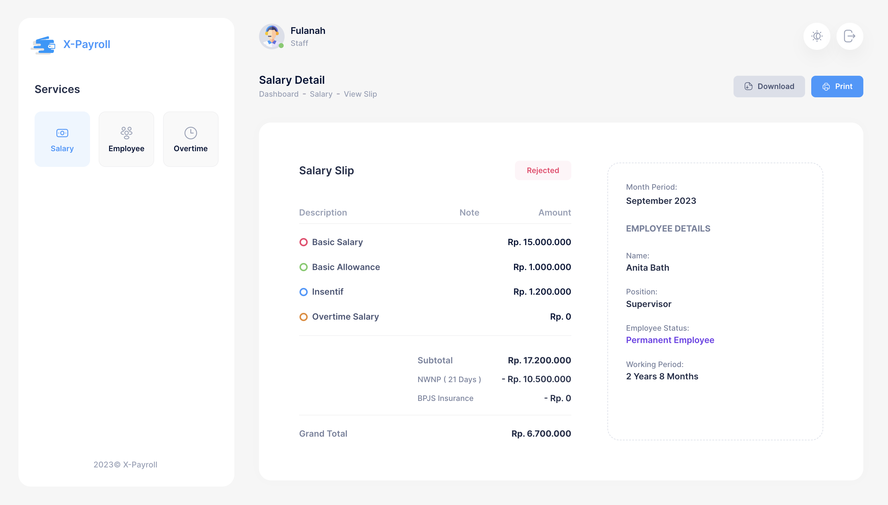

# X-Payroll Application

**Description:**
X-Payroll is a Laravel-based application designed for managing payroll-related tasks within an organization. It provides features for attendance and leave simulation, employee login (both as staff and supervisors), generating and managing monthly salary slips, as well as handling employee and overtime data. Additionally, it offers an API for simulating employee attendance.



## Features:

1. **Attendance and Leave Simulation:**
   - Simulate employee attendance and leave records.

2. **User Authentication:**
   - Users can log in as staff or supervisors.

3. **Salary Slip Management:**
   - View and generate monthly salary slips.
   - Print and download salary slips.
   - Approve or reject salary requests.

4. **Employee Management:**
   - Add, edit, and delete employee profiles.

5. **Overtime Management:**
   - Add, edit, and delete overtime data.

6. **Employee Attendance API Simulation:**
   - Simulate employee attendance through an API.

7. **Mode:**
   - You can see application in Light Mode or Dark Mode

8. **Auto Generate:**
   - Generate Monthly Slips Automatically using jobs
   
## How to Run the Program:

1. Clone the project from the master branch:
   ```
   git clone https://github.com/al-kadafi/simple-payroll.git
   ```

2. Navigate to the project directory and install dependencies:
   ```
   composer install
   ```

3. Copy the `.env.example` file to `.env`:
   ```
   cp .env.example .env
   ```

4. Configure your database settings by updating the following variables in the `.env` file:
   ```
   DB_DATABASE=<your_database_name>
   DB_USERNAME=<your_database_username>
   DB_PASSWORD=<your_database_password>
   ```

5. Generate the autoload files:
   ```
   composer dump-autoload
   ```

6. Migrate the database and seed it with initial data:
   ```
   php artisan migrate:refresh --seed
   ```

7. Run the application on the main host:
   ```
   php artisan serve
   ```

8. For the API host, run:
   ```
   php artisan serve --port 3001
   ```

9. Access the application in your browser at `http://localhost:8000`.

## Simulating Employee Attendance:

1. Use Postman or a similar tool.
2. Set the URL to `http://localhost:3001/api/get-absent-days`.
3. Set the `employee_id` and `month_period` as parameters.
4. Use the following client credentials:
   - Client ID: 76FD2153EFB37
   - Secret Key: E4gWSjezm67vRvr2IIBhdcIVH6M5NDp7Dv4fSqrXRvuJbNEChThRyp2QaGcBIwM6

## User Role:
1. **Staf**
   - email : fulanah@email.com
   - password : password

2. **Supervisor**
   - email : fulan@email.com
   - password : password

## Additional Data:
You can access all the flows for each feature, including SQL files for example data, in the data folder

## Tech Stack:

- Laravel 8.83.27

Feel free to reach out if you have any questions or need further assistance. Happy coding!